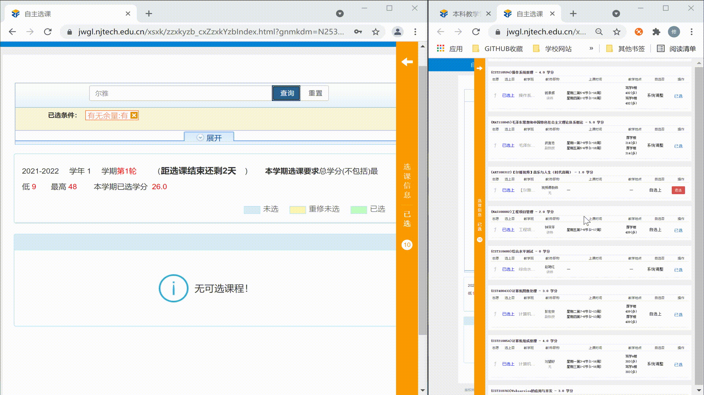

# 南京工业大学抢课小助手

本脚本暂时处于测试版阶段，示例代码可用于网课捡漏等，仅支持自用，禁止用于商业用途

## 效果图



## 环境配置

- Python3

- selenium

- chromedriver

- chrome

### 安装

默认已安装好python3 以及 chrome

#### 安装selenium库

`pip3 install selenium`

#### 下载chromedriver

根据自己电脑上的chrome版本下载对应版本的驱动

| [**ChromeDriver 93.0.4577.15**](https://chromedriver.storage.googleapis.com/index.html?path=93.0.4577.15/) | [**ChromeDriver 92.0.4515.107**](https://chromedriver.storage.googleapis.com/index.html?path=92.0.4515.107/) | [**ChromeDriver 92.0.4515.43**](https://chromedriver.storage.googleapis.com/index.html?path=92.0.4515.43/) |
| ------------------------------------------------------------ | ------------------------------------------------------------ | ------------------------------------------------------------ |
| [**ChromeDriver 91.0.4472.101**](https://chromedriver.storage.googleapis.com/index.html?path=91.0.4472.101/) | [**ChromeDriver 91.0.4472.19**](https://chromedriver.storage.googleapis.com/index.html?path=91.0.4472.19/) | [**ChromeDriver 90.0.4430.24**](https://chromedriver.storage.googleapis.com/index.html?path=90.0.4430.24/) |
| [**ChromeDriver 89.0.4389.23**](https://chromedriver.storage.googleapis.com/index.html?path=89.0.4389.23/) | [**ChromeDriver 88.0.4324.96**](https://chromedriver.storage.googleapis.com/index.html?path=88.0.4324.96/) | [**ChromeDriver 88.0.4324.27**](https://chromedriver.storage.googleapis.com/index.html?path=88.0.4324.27/) |
| [**ChromeDriver 87.0.4280.88**](https://chromedriver.storage.googleapis.com/index.html?path=87.0.4280.88/) | [**ChromeDriver 87.0.4280.20**](https://chromedriver.storage.googleapis.com/index.html?path=87.0.4280.20/) | [**ChromeDriver 86.0.4240.22**](https://chromedriver.storage.googleapis.com/index.html?path=86.0.4240.22/) |

  更多版本请访问(可能需要梯子)：https://sites.google.com/chromium.org/driver/downloads

## 脚本配置

- **将代码中的`chromedriver路径`替换为已下载到本地的路径**

  `driver=webdriver.Chrome(executable_path="chromedriver路径", options=option)`

- **将学号密码项填为自己的学号密码**

  `username.send_keys('学号')`

  `passwd.send_keys('密码')`

- **将搜索框内容填写为自己想要搜索的课程名称等，如：`尔雅`**

  `searchinput.send_keys("尔雅")`

- **对课程类别进行筛选（实例代码中以人文类为例，现已注释掉）**

  该代码模拟点击人文类选项的按钮，如需其他类别可自行查看网页html代码，修改下面代码的xpath，即`//li[@index='kcgs_list_12']`

  ```python
  #人文类
  rw_btn = driver.find_element_by_xpath("//li[@index='kcgs_list_12']")
  rw_btn.click()
  ```

  如觉得麻烦可直接在点击搜索按钮的代码之前停顿暂停脚本10s，用于自己手动勾选选课类别等

  即`time.sleep(10)`

  
