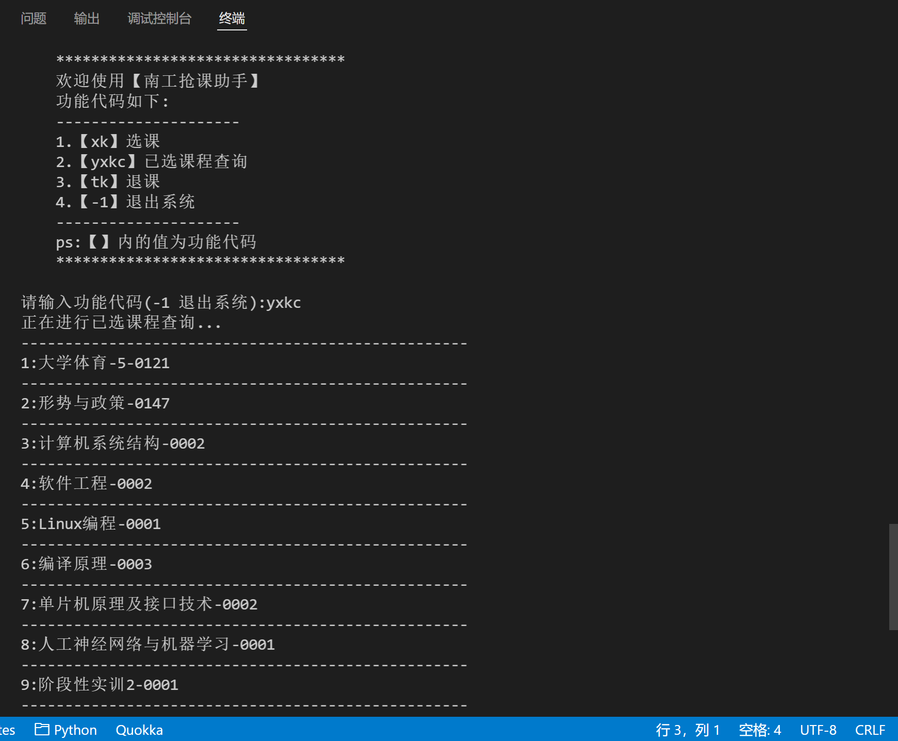
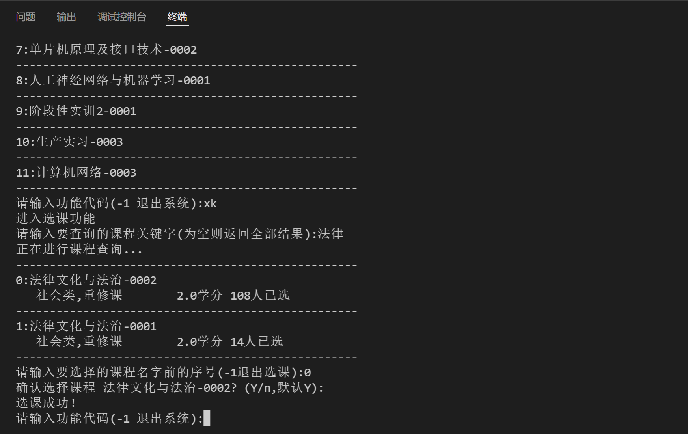
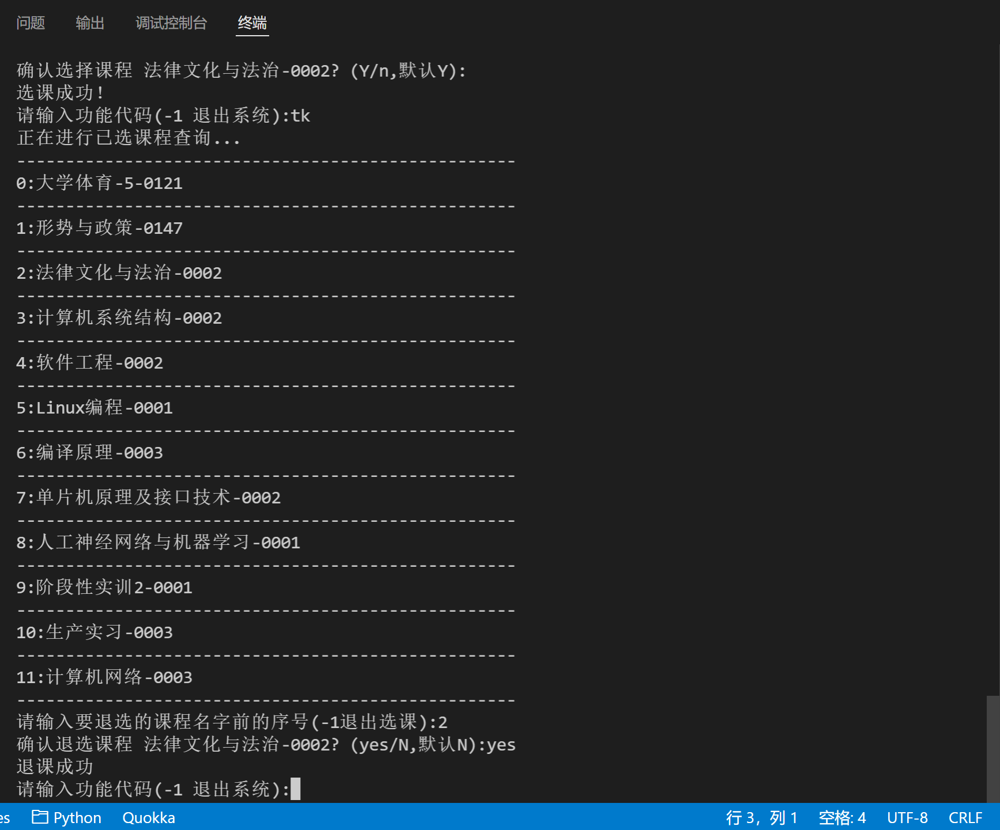

# 南京工业大学抢课小助手

本脚本暂时处于测试版阶段，示例代码可用于通识选修课选课退课等，仅支持自用，禁止用于个人盈利。

🎈代码修改，以及请求参数配置具体详见:<a href='https://github.com/shaxiu/ZF_API'>正方教务选课系统API分析文档</a>

✨模拟登录捡漏脚本详见:<a href='https://github.com/shaxiu/njtech_grabber/blob/main/Script(selenium).md'>模拟登录捡漏脚本</a>

---------------------------------------------------------------------------------------------------------------------------------------

## 功能

由于2021-2022第二学期选课改为分年级分时段
因此本抢课助手有了用武之地，具体功能如下:

- [x] 跨越时段限制选课，即当高年级可以选课的时候，低年级也可进行选课
- [x] 跨越限制进行退课，即页面不允许退课时，也可进行正常退课
- [x] 已选课程查询
- [ ] 自动获取cookie
- [ ] 自动获取`njdm_id`、` xkkz_id`、`xkxnm`、`xkxqm`
- [ ] 支持主修课选课
- [ ] 支持拓展英语课选课
- [ ] 支持体育课选课
- [ ] 支持多线程暴力抢课

## 效果图

## 环境配置

- Python3

- configparser

- requests

### 安装

默认已安装好python3

#### 安装库

`pip3 install configparser`

`pip3 install requests`

## 脚本配置

- 将`config.ini`与软件脚本放于同一目录下

- 登录选课系统，获取cookie，将`config.ini`中的`QINGCLOUDELB`和`JSESSIONID`的值替换为cookie中对应字段的值
- 登录现在可正常选课的账号，进入选课系统，F12打开开发者工具，在Elements(元素)界面中搜索`xkkz_id` ,并复制该值，若此时用户既可以进行主修课选课，也可以进行通识选修课选课，则用户在点击通识选修课按钮后再查找元素，搜索`xkkz_id`
- 将`config.ini`中的`xkkz_id`值替换为上述复制的值
- 将`xkxnm`替换为当前学年名，如2021-2022学年，则为`2021`
- 将`xkxqm`替换为当前学期，可直接在可正常选课的账号代码界面搜索到隐藏值
- 将`njdm_id`改为可正常选课的账号的年级号，如`2019`

## 卡bug的简易方法

注：方法主要针对分年级分时段选课，未到时间的用户无法进入通识选修课的界面的问题(前提是用户可正常进入主修课选课界面)

- F12查看网页代码，将`id='kklxdm'`的input框的`value`改为`10`

  其中`10`对应通识选修课，`01`对应主修课选课

- 修改完成后点击搜索，发现课程列表出现通识选修课，但无法正常点击展开课程进行选课

- 将`id='xkkz_id'`的input框的value改为`D8243C19A3C0239AE0530264A8C00F27`(暂时不确定该值是否为动态值)

  `xkkz_id`应该是用于再次验证是通识选修课还是主修选修课的

- 将`id='njdm_id'`的input框的value值改为允许现在选网课的年级如`2018`

- 再次点击课程，发现可以正常展开并进行选课
